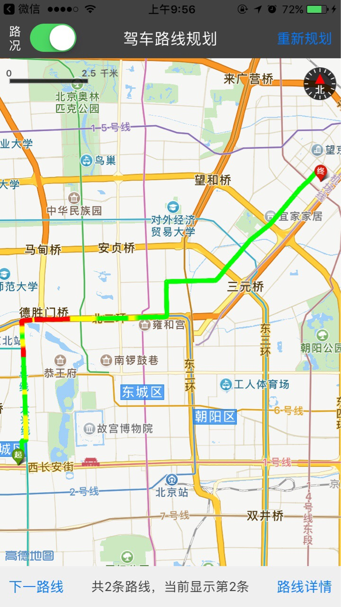
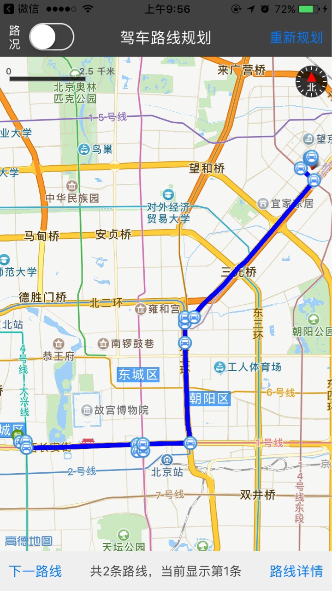

# iOS-drive-route
iOS驾车路线规划（带实时路况）demo

### 前述

- 工程是基于iOS 3D地图SDK实现的
- [高德官方网站申请key](http://lbs.amap.com/api/ios-sdk/guide/create-project/get-key/#t1).
- 阅读[驾车出行路线规划](http://lbs.amap.com/api/ios-sdk/guide/route-plan/drive/#paras-result).
- 查阅[参考手册](http://a.amap.com/lbs/static/unzip/iOS_Map_Doc/AMap_iOS_API_Doc_3D/index.html).

### 使用方法

- 运行demo请先执行pod install --repo-update 安装依赖库，完成后打开.xcworkspace 文件
- 如有疑问请参阅[自动部署](http://lbs.amap.com/api/ios-sdk/guide/create-project/cocoapods/).

### demo运行效果图

- 
- 
- 
